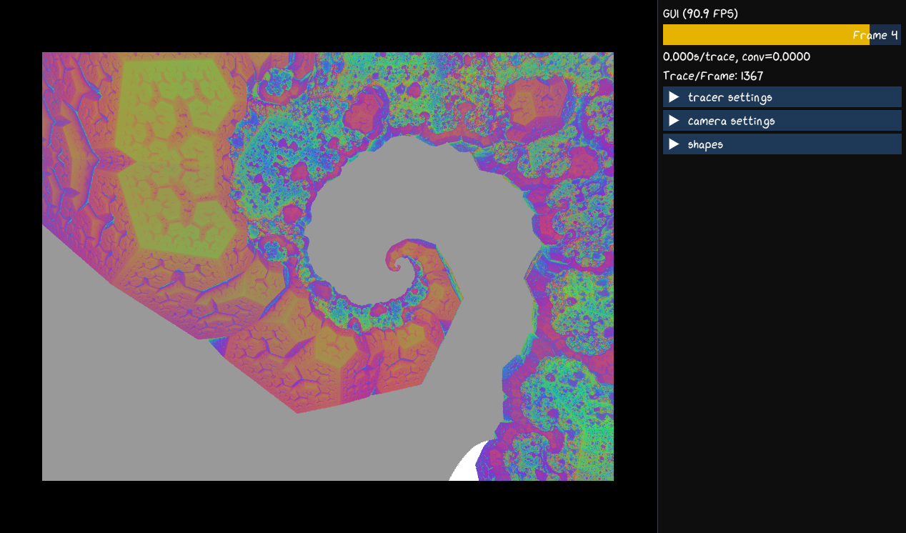

# EnvyWebTrace

EnvyWebTrace is a web port of the wildly popular EnvyTrace software.

See the [Live Demo](https://nvmsocool.github.io/EnvyWebTrace/imgui.html) here.

Screenshot:

</img>

This example uses Emscripted to compile c++ into Web Assembly (WASM) binaries that can be run as an application in the browser.

The source depends on OpenGL3, ES3, GLFW as well as Freetype and IMGui. I have attempted to make the most lightweight version of IMGUI possible to run in the browser.
